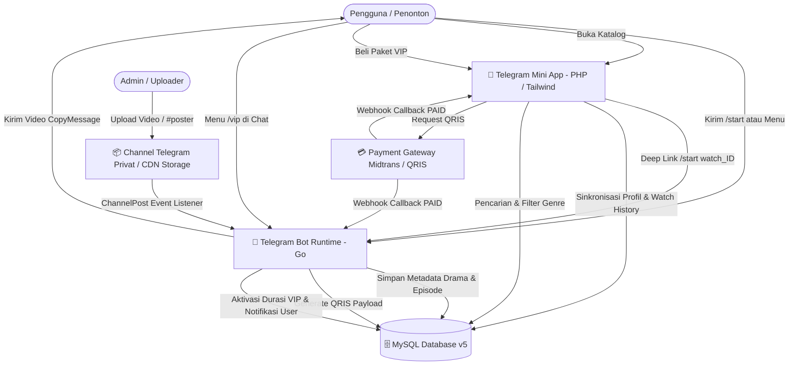

# 🎬 DramaBot - Fullstack Telegram Drama Streaming & Mini App Platform

<div align="center">


**Platform streaming drama pendek & mini-drama viral terlengkap dengan integrasi Telegram Bot, Telegram Mini App (Webview), Database MySQL v5, dan Gateway Pembayaran QRIS Otomatis.**

[Fitur Utama](#-fitur-utama) • [Arsitektur Sistem](#-arsitektur-sistem) • [Struktur Proyek](#-struktur-direktori) • [Panduan Instalasi](#-panduan-instalasi--konfigurasi) • [Dokumentasi API](#-dokumentasi-api--webhook) • [Perintah Bot](#-daftar-perintah-bot--admin)

</div>

---

## 🌟 Gambaran Umum (Overview)

**DramaBot** adalah ekosistem hiburan streaming drama pendek modern di dalam Telegram. Sistem ini menggabungkan kecepatan pengiriman video dari **Channel Telegram Privat (CDN Storage)** dengan antarmuka katalog visual interaktif dari **Telegram Mini App (TMA)**. 

### 💡 Keunggulan Utama:
- 🚀 **High Performance Backend (Go)**: Pemrosesan update bot real-time, event listener channel, dan REST API berkecepatan tinggi.
- 📱 **Sleek Mini App (PHP + TailwindCSS)**: Tampilan visual modern bertema dark-mode glassmorphism, responsif di semua perangkat mobile, mendukung multi-bahasa (ID/EN).
- 🔒 **Sistem VIP & Hak Akses Ketat**: Penguncian otomatis episode berbayar dengan verifikasi durasi aktif berbasis waktu (`vip_until`).
- 💳 **Pembayaran QRIS Otomatis**: Integrasi Midtrans & Generator QRIS instan dengan verifikasi status real-time melalui webhook dan polling.
- 📊 **Arsitektur Database Teruji**: Skema MySQL v5 Enterprise dilengkapi Stored Procedures (`sp_can_watch`), Functions (`fn_is_vip`), Views, dan Scheduled Events untuk auto-expire.

---

## 🏗️ Arsitektur Sistem



---

## 🚀 Fitur Utama

### 1. 🤖 Telegram Bot Core
- **Channel Storage Listener**: Otomatis mendeteksi video baru dari channel privat, mengekstrak judul drama, nomor part/episode, dan status VIP.
- **Admin Channel Commands**: Manajemen episode langsung dari channel tanpa buka database:
  - `#hapus_episode <message_id>`: Menghapus data episode dari database.
  - `#hapus_drama <Judul Drama>`: Menghapus seluruh judul drama dan relasinya secara permanen.
  - `#set_poster <Judul> | <file_id>`: Memperbarui poster/thumbnail drama.
  - Unggah foto dengan tag `#poster` untuk auto-update thumbnail drama.
- **Pengiriman Video Berkecepatan Tinggi**: Menggunakan metode `CopyMessage` dari channel privat tanpa watermark/forward header dan fallback `FileID`.
- **Navigasi Episode Terpadu**: Tombol interaktif *Episode Sebelumnya*, *Episode Selanjutnya*, dan tombol pintas kembali ke Mini App.

### 2. 📱 Telegram Mini App (TMA Frontend)
- **Katalog & Featured Banner**: Carousel drama unggulan dengan rating bintang, jumlah tayang, dan tag genre.
- **Pencarian Real-Time & Filter Genre**: Pencarian instan berdasarkan judul dan kategori dengan debounce otomatis.
- **Riwayat Tontonan (Watch History)**: Melacak progress tontonan (*Sedang Ditonton* vs *Selesai*) dengan fitur hapus riwayat.
- **Sistem Permintaan Drama (Request Drama)**: Formulir pengajuan judul drama baru dengan kuota harian dan notifikasi instan langsung ke Telegram Admin.
- **Program Afiliasi (Referral & Komisi)**: Sistem tingkatan komisi berjenjang (*Level 1 - Level 4*) dengan saldo koin dan tautan referral unik.
- **Multi-Bahasa (i18n)**: Pilihan bahasa instan antara Bahasa Indonesia (ID) dan English (EN).

### 3. 👑 Manajemen VIP & Pembayaran QRIS
- **7 Durasi Paket Langganan**:
  1. ⚡ **VIP 1 Hari** - Rp 3.000 / Rp 5.000
  2. ✨ **VIP 3 Hari** - Rp 6.000 / Rp 12.000
  3. 🎉 **VIP 7 Hari** - Rp 10.000 / Rp 25.000
  4. ⭐ **VIP 15 Hari** - Rp 20.000 / Rp 45.000
  5. 🔥 **VIP 30 Hari (Best Value)** - Rp 35.000 / Rp 75.000
  6. 💎 **VIP 90 Hari** - Rp 90.000 / Rp 180.000
  7. 👑 **VIP 365 Hari (1 Tahun)** - Rp 300.000 / Rp 500.000
- **Modal QRIS Interaktif**: Countdown timer 15 menit, live polling status pembayaran otomatis, dan panduan transfer bank/e-wallet.
- **Simulasi Pengujian Pembayaran**: Perintah bot `/simulate_pay <trx_code>` untuk kemudahan testing tanpa saldo riil.

---

## 📁 Struktur Direktori

```text
Bot_Telegram_Streaming_drama/
├── cmd/
│   └── bot/
│       └── main.go                     # Entry point bot Telegram & server HTTP
├── internal/
│   ├── bot/
│   │   ├── bot.go                      # Core lifecycle Telegram Bot & Update loop
│   │   ├── handlers_callback.go        # Handler tombol inline keyboard & QRIS
│   │   ├── handlers_channel.go         # Channel post listener, parser & admin command
│   │   ├── handlers_channel_test.go    # Unit test caption & poster parser
│   │   ├── handlers_command.go         # Handler slash commands (/start, /vip, dll)
│   │   ├── handlers_video.go           # Logika gatekeeper VIP & pengiriman video
│   │   ├── keyboards.go                # Konstruktor inline markup & reply keyboard
│   │   └── messages.go                 # Template pesan, teks panduan, & notifikasi
│   ├── config/
│   │   └── config.go                   # Pemuat variabel lingkungan .env
│   ├── database/
│   │   ├── models.go                   # Model struct data (User, Drama, Episode, Trx)
│   │   ├── mysql.go                    # Implementasi repository database MySQL
│   │   ├── repository.go               # Interface kontrak abstraksi database
│   │   ├── sqlite.go                   # Implementasi SQLite (development/fallback)
│   │   └── sqlite_test.go              # Unit test repositori SQLite
│   ├── payment/
│   │   └── payment.go                  # Layanan QRIS generator & Payment Coordinator
│   └── server/
│       └── server.go                   # HTTP API Server (Webhook & Mini App integration)
├── Homepage/                           # Telegram Mini App Frontend (Webview)
│   ├── index.php                       # Single Entry Point Mini App & routing
│   ├── api/
│   │   ├── add_history.php             # API pencatatan riwayat tontonan
│   │   ├── clear_history.php           # API pembersihan riwayat tontonan
│   │   ├── poster.php                  # Proxy loader gambar poster dari Telegram
│   │   ├── search.php                  # API pencarian drama & filter kategori
│   │   ├── submit_request.php          # API pengajuan request drama baru
│   │   └── user_sync.php               # API sinkronisasi data Telegram User ke DB
│   ├── includes/
│   │   ├── db_queries.php              # Kumpulan fungsi query database PHP
│   │   ├── nav.php                     # Navigasi bawah (Bottom Navigation Bar)
│   │   └── qris_modal.php              # Komponen modal pembayaran QRIS & timer
│   ├── js/
│   │   └── i18n.js                     # Sistem translasi multi-bahasa (ID / EN)
│   └── pages/
│       ├── home.php                    # Halaman utama katalog drama & banner
│       ├── history.php                 # Halaman riwayat tontonan
│       ├── vip.php                     # Halaman paket langganan VIP
│       ├── profile.php                 # Halaman profil akun & preferensi bahasa
│       ├── affiliate.php               # Halaman program komisi & referral
│       └── request.php                 # Halaman formulir request drama
├── payment/                            # Gateway Pembayaran Midtrans (PHP)
│   ├── check_status.php                # Endpoint cek status transaksi QRIS
│   ├── midtrans_config.php             # Konfigurasi Midtrans Server Key
│   ├── request_qris.php                # Endpoint inisialisasi QRIS Midtrans
│   └── webhook.php                     # Handler notifikasi webhook Midtrans
├── database/                           # Skema & Prosedur SQL
│   ├── schema_v5_final.sql             # Skema DDL tabel MySQL v5 Final
│   ├── procedures.sql                  # Stored Procedures & Functions
│   ├── scheduled_events.sql            # Event Scheduler auto-expire VIP
│   ├── seed_data.sql                   # Data awal (Kategori, Paket VIP, Drama)
│   ├── backup_daily.bat                # Script automasi backup harian MySQL
│   └── koneksi.php                     # Koneksi database PDO untuk PHP
├── .env.example                        # Template konfigurasi environment
├── .env                                # Konfigurasi aktif (rahasia)
├── Dockerfile                          # Konfigurasi container Docker multi-stage
├── docker-compose.yml                  # Orkestrasi container Docker
├── go.mod                              # Modul dependencies Golang
└── README.md                           # Dokumentasi resmi proyek
```

---

## 🛠️ Panduan Instalasi & Konfigurasi

### 📋 Prasyarat Sistem
- **Golang**: v1.22 atau lebih baru
- **PHP**: v8.1 atau lebih baru (dengan ekstensi `pdo_mysql`, `curl`)
- **MySQL**: v8.0 atau MariaDB 10.5+
- **Web Server**: Apache / Nginx / PHP Built-in Server (atau tunneling ngrok)
- **Akun Telegram** & Token Bot dari [@BotFather](https://t.me/BotFather)

---

### 1️⃣ Konfigurasi Database MySQL
1. Buat database baru di MySQL:
   ```sql
   CREATE DATABASE bot_drama CHARACTER SET utf8mb4 COLLATE utf8mb4_unicode_ci;
   ```
2. Impor berkas SQL secara berurutan:
   ```bash
   mysql -u root -p bot_drama < database/schema_v5_final.sql
   mysql -u root -p bot_drama < database/seed_data.sql
   mysql -u root -p bot_drama < database/procedures.sql
   mysql -u root -p bot_drama < database/scheduled_events.sql
   ```

---

### 2️⃣ Konfigurasi File Lingkungan (`.env`)
Salin file template `.env.example` menjadi `.env`, lalu lengkapi isinya:
```bash
cp .env.example .env
```

Sesuaikan nilai variabel:
```env
# Token bot resmi dari Telegram @BotFather
BOT_TOKEN=1234567890:ABCdefGHIjklMNOpqrSTUvwxYZ

# Username bot Telegram tanpa tanda @
BOT_USERNAME=TreadLessBot

# ID Channel Privat penyimpanan video (diawali -100)
PRIVATE_CHANNEL_ID=-1001234567890

# URL Webhook Mini App (gunakan HTTPS / URL Ngrok untuk pengujian)
WEB_APP_URL=https://your-domain.com/Homepage/index.php

# Grup / Channel Resmi Komunitas
OFFICIAL_GROUP_URL=https://t.me/DramaBotGroup

# ID Telegram Admin untuk menerima laporan upload & request
ADMIN_USER_ID=123456789

# Port HTTP Server Go
SERVER_PORT=8080

# Koneksi Database MySQL Backend Go
DATABASE_DSN=root:password@tcp(localhost:3306)/bot_drama?parseTime=true&charset=utf8mb4

# Server Key Midtrans Payment Gateway
MIDTRANS_SERVER_KEY=SB-Mid-server-xxxxxxxxxxxxxxxxx
```

---

### 3️⃣ Menjalankan Bot & Backend (Golang)

1. Unduh seluruh dependensi Go:
   ```bash
   go mod download
   ```
2. Jalankan unit test untuk memastikan integritas:
   ```bash
   go test -v ./...
   ```
3. Jalankan bot:
   ```bash
   go run ./cmd/bot/main.go
   ```

---

### 4️⃣ Menjalankan Mini App Frontend (PHP)

Jalankan built-in web server PHP dari direktori proyek:
```bash
php -S localhost:8000
```
Untuk menguji di aplikasi Telegram pada perangkat ponsel, gunakan tunneling HTTPS seperti **ngrok**:
```bash
ngrok http 8000
```
Lalu perbarui `WEB_APP_URL` di file `.env` dengan URL HTTPS dari ngrok.

---

### 5️⃣ Menjalankan via Docker (Opsional)

Aplikasi dapat dijalankan secara terisolasi menggunakan Docker Compose:
```bash
docker-compose up --build -d
```

---

## 📡 Dokumentasi API & Webhook

### 1. HTTP Server Bot (Golang - Port 8080)

| Method | Endpoint | Deskripsi | Payload / Parameter |
| :--- | :--- | :--- | :--- |
| `POST` | `/api/payment/webhook` | Webhook konfirmasi pembayaran QRIS | `{"transaction_code": "TRX123", "status": "PAID"}` |
| `POST` | `/api/send-episode` | Kirim video episode langsung ke chat user | `{"telegram_id": 12345, "episode_id": 1}` |
| `GET`  | `/api/plans` | Ambil daftar paket VIP aktif format JSON | *None* |
| `GET`  | `/api/health` | Healthcheck status server | *None* |

### 2. Mini App API (PHP)

| Method | Endpoint | Deskripsi |
| :--- | :--- | :--- |
| `GET`  | `Homepage/api/search.php?q=keyword&cat=genre` | Pencarian & filter katalog drama |
| `GET`  | `Homepage/api/poster.php?fid=TELEGRAM_FILE_ID` | Proxy image loader untuk thumbnail Telegram |
| `POST` | `Homepage/api/user_sync.php` | Sinkronisasi profil user Telegram ke DB |
| `GET`  | `Homepage/api/add_history.php?episode_id=1` | Catat progress tontonan pengguna |
| `POST` | `Homepage/api/submit_request.php` | Pengajuan request drama baru ke admin |
| `GET`  | `payment/request_qris.php` | Request pembuatan invoice QRIS Midtrans |
| `GET`  | `payment/check_status.php?order_id=TRX` | Polling cek status pembayaran QRIS |
| `POST` | `payment/webhook.php` | Webhook listener callback Midtrans |

---

## ⌨️ Daftar Perintah Bot & Admin

### 👤 Perintah Pengguna (User Commands)
- `/start` : Membuka menu utama, cek status akun, dan tautan ke Mini App.
- `/start watch_<episode_id>` : Deep link instan untuk memutar episode tertentu.
- `/vip` : Menampilkan katalog 7 pilihan paket langganan VIP.
- `/status` : Memeriksa sisa masa aktif langganan VIP akun.
- `/tutorial` : Panduan langkah demi langkah cara menonton dan berlangganan.
- `/bantuan` : Pusat informasi bantuan dan FAQ.

### 🛡️ Perintah Admin & Channel (Admin Controls)
- `/set_poster <Judul Drama> | <File_ID>` : Menyetel poster drama via DM admin.
- `/simulate_pay <TRX_CODE>` : Simulasi pelunasan transaksi untuk pengujian.
- `#hapus_episode <message_id>` : Ditulis di channel privat untuk menghapus episode dari database.
- `#hapus_drama <Judul Drama>` : Ditulis di channel privat untuk menghapus seluruh serial drama.
- `#set_poster <Judul> | <file_id>` : Ditulis di channel privat untuk update poster drama.
- **Upload Gambar + Caption `#poster`** : Otomatis memperbarui thumbnail serial drama di database dan Mini App.

---

## 📄 Lisensi & Kontribusi

Proyek ini dikembangkan untuk kebutuhan platform streaming drama interaktif Telegram. Silakan lakukan *fork*, buat *feature branch*, dan ajukan *Pull Request* untuk berkontribusi.

<div align="center">
Made with ❤️ by DramaBot Engineering Team
</div>
